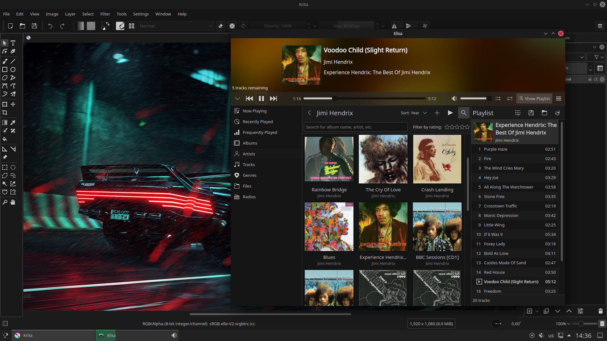

# Night Owl (KDE Plasma Color Scheme)

## About

Night Owl is based on [Monochrome KDE](https://gitlab.com/pwyde/monochrome-kde) and [Breeze Dark](https://develop.kde.org/hig/style/color/dark/) color schemes.

## How to install

Just put `night-owl.colors` in your home directory (`.local/share/color-schemes/`) and enjoy.

  

  

